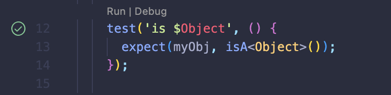

# Dart test package description bug

## Bug description

Once you're trying to run test, which description contains variable or type used in other test, multiple tests would be executed.


[Ref](test/my_obj_test.dart).

## Steps to reproduce

Run test via CLI

``` bash
dart test test/my_obj_test.dart -N "is $Object" --reporter=expanded
```

Run test `isObject` via ▶️ button in IDE.


